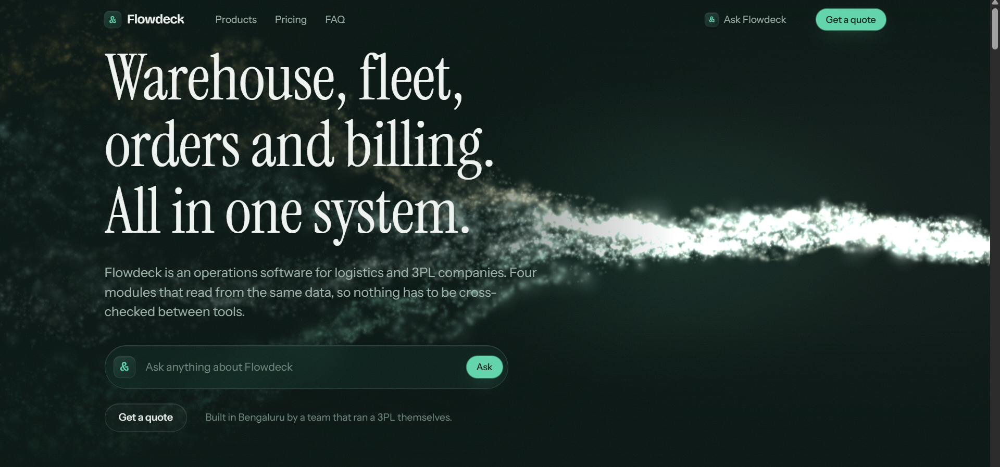
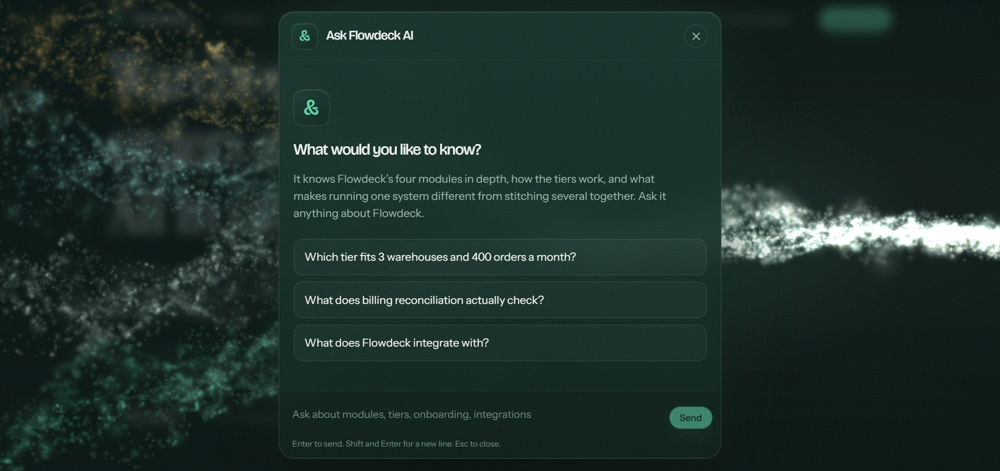
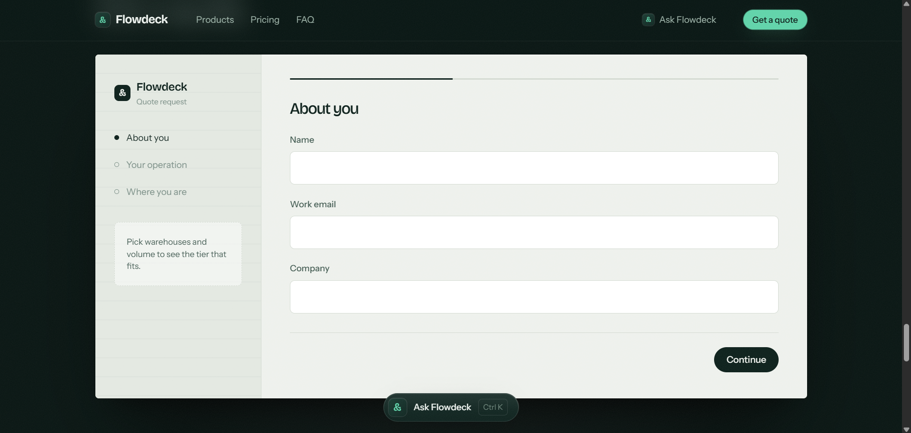
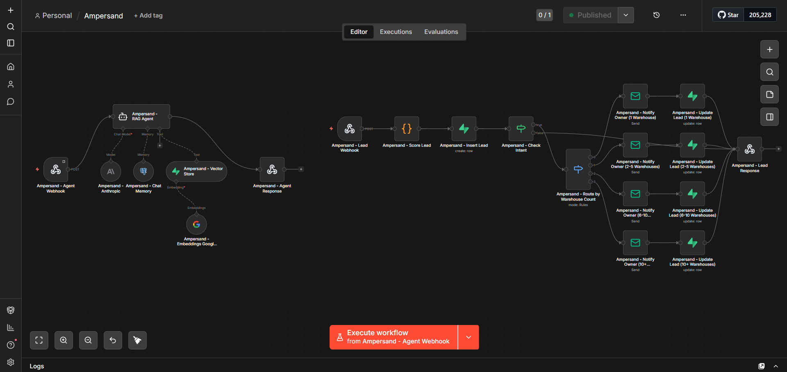

<p align="center">
  
</p>

<p align="center">
  <a href="#1-look-at-it-first">Look at it</a> •
  <a href="#2-what-you-need">What you need</a> •
  <a href="#3-setting-up-the-automation">Setup</a> •
  <a href="#4-where-the-placeholders-and-secrets-go">Placeholders</a> •
  <a href="#5-making-it-yours">Making it yours</a> •
  <a href="#6-what-the-two-endpoints-expect">Endpoints</a> •
  <a href="#7-the-flowdeck-demo">The demo</a> •
  <a href="#8-how-the-repo-is-put-together">Structure</a>
</p>

<p align="center">
  
  
  
  
  
  
  
</p>

# Ampersand

A website that answers visitors' questions from your own documents, and turns every contact
form submission into a scored, routed lead.

It is built as an n8n workflow with two independent chains. The **agent chain** takes a message,
searches a knowledge base, remembers the conversation, and replies. The **lead chain** takes a
form submission, scores it, saves it, and emails the right person when the lead is a strong one.
Either one is one HTTP request from any website.

The model answers questions and nothing else. Scoring and routing are ordinary workflow logic,
so a lead's score and its owner never depend on what a model happened to say.

**This repository ships configured for a fictional company.** Flowdeck, logistics software, is
invented for the demo. The prompts and form fields in the workflow are set up for it. That is a
placeholder, and section 5 says exactly where to change it.

**There are two parts, and you can use either on its own.**

| | `generic/` | `demo/` |
|---|---|---|
| What it is | The n8n workflow export, and one plain HTML page that talks to it | The full Flowdeck site built on the same workflow, with its knowledge base |
| Who it is for | Anyone who wants to run the automation for their own project | Anyone who wants to see the finished project as it was built and shown |
| Needs | A browser, and an n8n you can import into | Node.js 20.19 or newer |
| Where to read | Sections 2 to 6 | Section 7 |

The demo was built by the developer and is shared on the developer's LinkedIn page and portfolio
website, as two demos: one for the agent, one for lead routing. Both are described in section 7.

---

## 1. Look at it first

No keys and no accounts.

```
git clone https://github.com/RTN107/Ampersand.git
cd Ampersand/demo
npm install
npm run dev
```

Open http://localhost:5173. The site and its animation run as they do in the demos. The agent
and the form need your own webhook URLs before they do anything, which is section 3. Sending
a message before then shows an error.

For the plain page, open `generic/website/index.html` in a browser by double clicking it. It
shows a chat box and a form, and each says plainly that it is not connected yet.

Everything below is for connecting them to a backend of your own.

---

## 2. What you need

| Requirement | What for |
|---|---|
| [n8n](https://n8n.io/) | Runs the workflow. Self-hosted, Docker and n8n Cloud all work, and `npx n8n` starts a local one at http://localhost:5678 |
| A Supabase project | Holds the knowledge base vectors, the chat history and the leads |
| An AI API key | The agent's model |
| A Google Gemini API key | Embeds each question, so it can be matched against your knowledge base |
| An SMTP account | Sends the lead notification emails |
| A knowledge base of your own | The documents the agent answers from |
| Node.js 20.19 or newer | The demo site only. The plain page needs nothing but a browser |

There is no build step for the plain page and no dependency to install.

---

## 3. Setting up the automation

### 3.1 Get the code

```
git clone https://github.com/RTN107/Ampersand.git
cd Ampersand
```

### 3.2 Set up your data

**Left open on purpose.** How to split your documents into chunks, which embedding model to
use, and how to store the result all depend on your content and your goals. This repository
does not include an ingestion script or a chunking approach, and it does not prescribe a
database setup. That part is yours to design.

What the workflow expects to find:

| Table | Used by | What it holds |
|---|---|---|
| `documents` | `Ampersand - Vector Store` | Your knowledge base, as embedded chunks. The agent searches this |
| `chat_messages` | `Ampersand - Chat Memory` | The conversation history, in the shape n8n's Postgres Chat Memory node requires |
| `leads` | `Ampersand - Insert Lead`, `Ampersand - Update Lead` nodes | One row per form submission |

The workflow embeds each incoming question with the model set on `Ampersand - Embeddings Google
Gemini`. The chunks in `documents` must have been embedded with that same model, or you must
change that node to the model you used.

The demo made its own choices, and they are written up in
[`demo/TECHNICAL.md`](demo/TECHNICAL.md) as one worked example: how its knowledge base was
chunked, which model embedded it, and the shape of all three tables. Treat it as a reference
rather than a recipe.

### 3.3 Import the workflow

In n8n, create a workflow and use **Import from file**, choosing
[`generic/workflow/ampersand-workflow.json`](generic/workflow/ampersand-workflow.json).

This creates one workflow named **Ampersand** holding both chains. It imports switched off,
which is what you want until the steps below are done. What every node does is in
[`generic/GENERIC-GUIDE.md`](generic/GENERIC-GUIDE.md#4-the-workflow).

### 3.4 Connect your credentials

The export carries no credentials. Each node that needs one shows a placeholder named like
`Anthropic account (add your own API key)`. Open the node, choose or create your own credential,
and save.

| Credential type | Nodes | What to add |
|---|---|---|
| Anthropic | `Ampersand - Anthropic` | Your Anthropic API key |
| Google Gemini (PaLM) API | `Ampersand - Embeddings Google Gemini` | Your Gemini API key |
| Supabase API | `Ampersand - Vector Store`, `Ampersand - Insert Lead`, and the four `Ampersand - Update Lead` nodes | Your Supabase project credentials |
| Postgres | `Ampersand - Chat Memory` | A connection to your Supabase database |
| SMTP | The four `Ampersand - Notify Owner` nodes | Your SMTP login |

### 3.5 Set the email addresses

Each of the four `Ampersand - Notify Owner` nodes has two placeholder addresses:

| Field | Placeholder | Put here |
|---|---|---|
| From Email | `you@example.com` | The address you send from |
| To Email | `sales@example.com` | Who should receive that node's leads |

The four nodes are the four routing branches. Give each its own recipient if different people
should get different leads. Section 5 explains the branches.

### 3.6 Get your webhook URLs

Open `Ampersand - Agent Webhook` and `Ampersand - Lead Webhook`. Each shows two URLs.

| URL | When it works |
|---|---|
| **Test URL**, containing `webhook-test`, such as `http://localhost:5678/webhook-test/agent-chat` | Only for one request, after you click **Execute workflow** in the editor. Then it stops until you click again. Good for watching the canvas light up |
| **Production URL**, containing `webhook`, such as `http://localhost:5678/webhook/agent-chat` | Any time, but only while the workflow is switched on with the **Active** toggle |

For a site that stays up, switch the workflow on and use the production URLs. Copy both.

### 3.7 Point the plain page at them

Open [`generic/website/index.html`](generic/website/index.html) in a text editor. The `SETUP`
block is at the top of the script. Replace the two placeholders:

```js
const AGENT_CHAT_URL = "PASTE_YOUR_AGENT_CHAT_WEBHOOK_URL_HERE";
const LEAD_CAPTURE_URL = "PASTE_YOUR_LEAD_CAPTURE_WEBHOOK_URL_HERE";
```

Open the file in a browser. Until a placeholder is replaced, that half of the page shows a
setup message and sends nothing.

If you would rather serve it than open the file, any static server works, for example
`npx serve generic/website`.

**If the browser reports a CORS error**, the page is on a different origin from n8n and n8n is
refusing it. The Webhook node has an **Allowed Origins (CORS)** option under Options. Set it on
both webhook nodes.

### 3.8 Check it works

Send a chat message and expect a reply. Fill in the form and expect a confirmation message.
Then look at your `leads` table for the new row. If it scored 12 or more, the matching
`Notify Owner` node also sent an email and the row's `assigned_owner` is set.

Nothing will score high until the form fields match what the workflow scores. That is the
first thing in section 5.

---

## 4. Where the placeholders and secrets go

This repository contains no secrets. Yours live in three places, none of them committed.

| Where | What it holds | How it gets there |
|---|---|---|
| n8n's credential store | The Anthropic key, Gemini key, Supabase and Postgres credentials, SMTP login | You add them in n8n in step 3.4 |
| `demo/.env` | The demo's two webhook URLs | You copy `demo/.env.example` to `demo/.env`. It is git-ignored |
| `generic/website/index.html` | The plain page's two webhook URLs | You edit the two constants in step 3.7 |

Anyone who opens the plain page can read its source, so treat those two URLs as public. If that
matters for your use, protect the webhooks on the n8n side.

Every placeholder in the repository, in one table:

| Placeholder | File | Replace with |
|---|---|---|
| Credentials named like `... (add your own)`, on 13 nodes | `generic/workflow/ampersand-workflow.json`, once imported | Your own credentials, step 3.4 |
| `you@example.com` on four nodes | Same file, the four `Ampersand - Notify Owner` nodes | Your sending address |
| `sales@example.com` on four nodes | Same file, the same four nodes | Your recipient |
| `PASTE_YOUR_AGENT_CHAT_WEBHOOK_URL_HERE` | `generic/website/index.html`, constant `AGENT_CHAT_URL` | Your agent webhook URL |
| `PASTE_YOUR_LEAD_CAPTURE_WEBHOOK_URL_HERE` | `generic/website/index.html`, constant `LEAD_CAPTURE_URL` | Your lead webhook URL |
| `VITE_AGENT_CHAT_URL` | `demo/.env`, copied from `demo/.env.example` | Your agent webhook URL |
| `VITE_LEAD_CAPTURE_URL` | `demo/.env` | Your lead webhook URL |
| `VITE_DEMO_MODE` | `demo/.env` | Leave `false`, or `true` to switch the agent and form off with no network calls |

---

## 5. Making it yours

The workflow ships set up for the Flowdeck demo, so its form fields, scoring and prompts are
Flowdeck's. Here is where each one lives.

### 5.1 The form fields

The plain page builds its form from the `FORM_FIELDS` array in `generic/website/index.html`.
Add, remove, rename or retype a field by editing that array, and nothing else in the page. The
`id` of each entry is the key sent to the workflow. Every option of the array is described in
[`generic/GENERIC-GUIDE.md`](generic/GENERIC-GUIDE.md#32-changing-the-form-fields).

**The default fields are a generic example and will not score.** The workflow scores four
specific fields by their exact wording. To use the workflow as shipped, replace `FORM_FIELDS`
with the seven fields it expects, and keep every `id` and option exactly as written, including
capitalisation and spacing:

```js
const FORM_FIELDS = [
  { id: "name", label: "Name", type: "text", required: true },
  { id: "email", label: "Email", type: "email", required: true },
  { id: "company", label: "Company", type: "text", required: true },
  { id: "warehouse_count", label: "How many warehouses?", type: "select", required: true,
    options: ["1", "2-5", "6-10", "10+"] },
  { id: "order_volume", label: "Orders a month", type: "select", required: true,
    options: ["Under 500", "500 to 5000", "5000 to 20000", "20000+"] },
  { id: "current_tooling", label: "What are you using today?", type: "select", required: true,
    options: ["Spreadsheets or manual", "Nothing", "Another platform"] },
  { id: "timeline", label: "When are you looking to move?", type: "select", required: true,
    options: ["This month", "This quarter", "Just exploring"] }
];
```

### 5.2 The automation

Change the fields, the scoring or the routing by editing these nodes in n8n. When a change
touches the form, the right hand column says what to change in the page or the database too.

| You want to | Change these nodes | Also change |
|---|---|---|
| Add, remove or rename a form field | `Ampersand - Insert Lead`, the field mapping | The `id` in `FORM_FIELDS`, and a matching column in `leads` |
| Change how leads are scored | `Ampersand - Score Lead`, the weight tables and the `score >= 12` line | The options in `FORM_FIELDS`, which must match the keys of those tables exactly |
| Change what counts as high intent | `Ampersand - Score Lead` (the threshold) and `Ampersand - Check Intent` | Nothing in the page |
| Change who receives which lead | `Ampersand - Route by Warehouse Count` for the rule, then each `Ampersand - Notify Owner` node for the recipient, subject and body | Nothing in the page |
| Change the owner label saved on the lead | The four `Ampersand - Update Lead` nodes (`Owner A` to `Owner D`) | Nothing in the page |
| Change what the agent says or refuses to say | The system prompt in `Ampersand - RAG Agent`. It currently names Flowdeck | Nothing in the page |
| Change what the agent's search tool is described as | The tool description in `Ampersand - Vector Store` | Nothing in the page |
| Change the model | `Ampersand - Anthropic`, which needs a model your Anthropic account can call | Nothing in the page |
| Change the page's wording or look | Nothing in n8n | The `TEXT` object and the CSS variables in `index.html` |

The routing rule as shipped sends a high-intent lead to one of four branches by warehouse
count, and a low-intent lead to no branch at all. It is still saved.

### 5.3 The demo site's form

The demo site's form works the same way, with its fields in code rather than in one array. The
option lists, with their exact wording, are in
[`demo/src/lib/tier.ts`](demo/src/lib/tier.ts), and the three steps are in
[`demo/src/components/QuoteForm.tsx`](demo/src/components/QuoteForm.tsx). The same rule
applies: what it sends must match what the workflow reads.

---

## 6. What the two endpoints expect

Both are `POST` requests with a JSON body and `Content-Type: application/json`. Anything that
sends these can be the front end, not just the two included here.

| | Agent chat | Lead capture |
|---|---|---|
| Sends | `{ "message": "...", "session_id": "..." }` | A flat object, one key per form field |
| Gets back | `{ "reply": "..." }` | `{ "success": true, "message": "..." }` |
| Notes | `session_id` identifies one conversation. The front ends make one per page load, in memory | Every submission gets the same reply, so the visitor never sees a score or a routing decision |

Chat memory is kept on the n8n side, keyed by `session_id`. The front end sends only the newest
message. Which form field feeds which node is in
[`generic/GENERIC-GUIDE.md`](generic/GENERIC-GUIDE.md#2-how-the-page-and-the-workflow-fit-together).

---

## 7. The Flowdeck demo

`demo/` is a complete marketing site for Flowdeck, an operations software company for logistics
and 3PL teams. Flowdeck is fictional. It exists so the agent and the lead automation have
something realistic to be about.

The demo was developed to show what this workflow does inside a real looking product. It is
shared on the developer's LinkedIn page and portfolio website, as two demos: one for the agent
and one for lead routing.

Both were recorded against n8n's test-mode webhooks on purpose. A test webhook accepts one
request after **Execute workflow** is clicked, which lets the canvas be recorded live, with each
node lighting up as the request passes through it.

How everything underneath works, from the knowledge base to the database to the scoring, is in
[`demo/TECHNICAL.md`](demo/TECHNICAL.md).

### 7.1 The agent demo

Shared on the developer's LinkedIn page and portfolio website as the agent demo video.

<p align="center">
  
</p>

The site has a live agent that answers from Flowdeck's knowledge base. It is not a chat bubble
in a corner. It opens as a large panel with three suggested questions to start from, and there
are several ways in: the input bar in the hero, a pill that follows the reader down the page,
a section of its own, and **Ctrl or Cmd K**.

Behind the panel, each message goes to the agent webhook. The agent searches the knowledge
base, remembers the conversation so a follow-up like "does that apply to smaller operators too"
still makes sense, and replies. It never states a price. It sends people to the form for one,
and suggests the form on its own when a visitor reveals a buying signal, such as a warehouse
count or a timeline.

The files behind it:

| File | What it does |
|---|---|
| [`demo/src/components/AgentPanel.tsx`](demo/src/components/AgentPanel.tsx) | The expanded panel, the word by word reply, the thinking state, and the error and retry states |
| [`demo/src/components/AgentContext.tsx`](demo/src/components/AgentContext.tsx) | Chat state, and the session id, made once per page load and never stored, so a reload starts fresh |
| [`demo/src/components/AskBar.tsx`](demo/src/components/AskBar.tsx), [`DockedPill.tsx`](demo/src/components/DockedPill.tsx), [`AgentSection.tsx`](demo/src/components/AgentSection.tsx) | The three other ways in |
| [`demo/src/lib/api.ts`](demo/src/lib/api.ts) | The one place the chat request is made |
| [`demo/knowledge/flowdeck-knowledge-base.md`](demo/knowledge/flowdeck-knowledge-base.md) | The document the agent answers from: company, product, pricing, differentiation and frequently asked questions |

### 7.2 The lead routing demo

Shared on the developer's LinkedIn page and portfolio website as the lead routing demo.

<p align="center">
  
</p>

The quote form is a sheet of paper on the dark page, in three short steps: who you are, what
you run, and where you are. The second and third steps use tiles instead of dropdowns, and a
note in the margin shows which pricing tier the answers fit. Behind the button, the form sends
seven values to the lead webhook.

The files behind it:

| File | What it does |
|---|---|
| [`demo/src/components/QuoteForm.tsx`](demo/src/components/QuoteForm.tsx) | The three steps, validation, and the success and failure states |
| [`demo/src/lib/tier.ts`](demo/src/lib/tier.ts) | The exact wording of every option the workflow scores, and the tier rule |
| [`demo/src/lib/api.ts`](demo/src/lib/api.ts) | The one place the form request is made |

What happens after the button is the automation. Every submission is scored from four of its
answers, saved, and answered with the same generic thank you, so the visitor learns nothing
about their score. A score of 12 or more is high intent. A high-intent lead goes to one of four
owners by warehouse count, gets a notification email, and has its row updated with the owner.
A lower score is saved and goes no further.

<p align="center">
  
</p>

The canvas above is the whole workflow. The agent chain is on the left and the lead chain on
the right. The scoring weights, the routing table and the exact wording each field is matched
on are in [`demo/TECHNICAL.md`](demo/TECHNICAL.md#6-lead-scoring-and-routing-workflow).

### 7.3 Run the demo locally

Needs Node.js 20.19 or newer.

```
cd demo
npm install
cp .env.example .env
```

Fill in the two URLs in `demo/.env` from step 3.6, then:

```
npm run dev          # http://localhost:5173
```

Other commands: `npm run build` type checks and builds to `demo/dist`, and `npm run preview`
serves that build. The demo's own file map is in [`demo/DEMO-GUIDE.md`](demo/DEMO-GUIDE.md).

Set `VITE_DEMO_MODE=true` to run the site with the agent and the form visible but switched
off, sending nothing anywhere. That is how to host it with no backend behind it.

---

## 8. How the repo is put together

```
Ampersand/
├── generic/                          Run the automation yourself
│   ├── GENERIC-GUIDE.md              The plain page and the workflow, node by node
│   ├── workflow/
│   │   └── ampersand-workflow.json   The n8n export: agent chain and lead chain
│   └── website/
│       └── index.html                The plain page: a chat box and a configurable form
├── demo/                             The Flowdeck site, built on the same workflow
│   ├── src/                          The site's source
│   ├── knowledge/
│   │   └── flowdeck-knowledge-base.md
│   ├── .env.example                  The demo's placeholders
│   ├── DEMO-GUIDE.md                 The demo's file map and run steps
│   └── TECHNICAL.md                  How the demo works underneath, in full
├── docs/
│   └── images/                       The four screenshots used in this README
└── README.md                         This file, the main README
```

---

## 9. Limits

The workflow and the demo site were built together. The plain page was written
afterwards, and has been tested in a browser against a mocked backend, not yet against a live
n8n.

Nothing authenticates a visitor. Anyone who has a webhook URL can call it. Add validation and
rate limiting on the n8n side before you put either front end in front of real traffic.

The plain page shows the agent's reply as text. It does not render markdown or stream.

Test-mode webhooks stop after one request. That is deliberate for recording, and wrong for a
live site, so switch the workflow on and use the production URLs for anything that stays up.

Flowdeck, its knowledge base, its pricing and its leads are fictional. The company and everything
about it were invented for this project.
